# 온 가족 소통 어플 Honey bee project 

### 진행 기간
2021/03/26 ~ 2021/10/27
 

### 프로젝트 동기
한 지붕 아래 사는 가족이라도 나이가 들고 바쁜 일상에 치이다 보면 가족관의 간계가 삭막해지고 하루 한마디 대화 힘든 경우가 많다. 이러한 의사소통 부족의 문제를 해결하고자 어플을 만들게 되었다. 
 

### 프로젝트 개발 일정
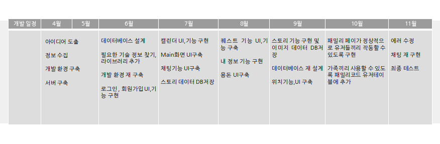

### 개발 환경 
|구분|내용
|---|-------|
|OS |Window10|
|Development Tool|Android studio 4.2.5|
|Language|Java|
|Library|volleyplus,OKHttp,Glide|
|Server|Localhost via UNIX socket(Dothome제공)|
|Server Type|MySQL|
|Server Version|5.7.34 - MySQL Community Server(GPL)|
|Web Server|Apache/2.2.15(CentOS)|
|API|Google Map API|

 

## 시스템 구조도
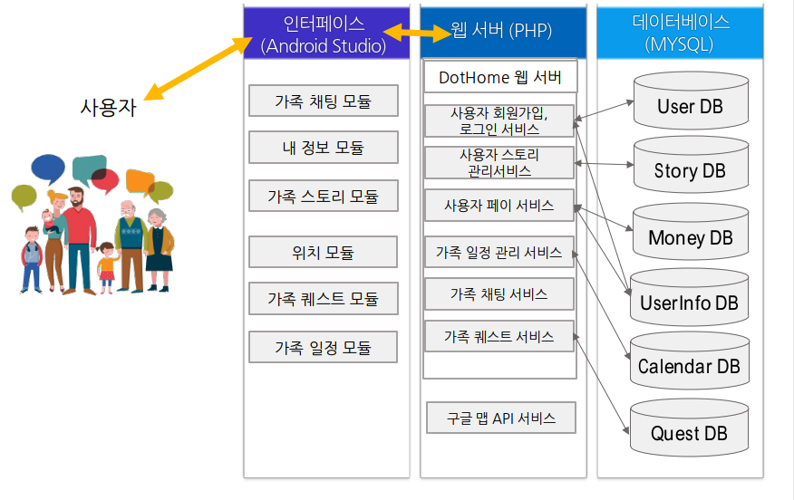

 

## 데이터베이스 구조도(ERD)
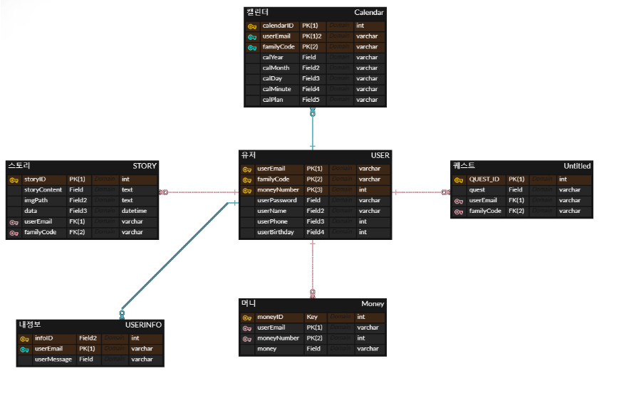

 

## 화면 구성
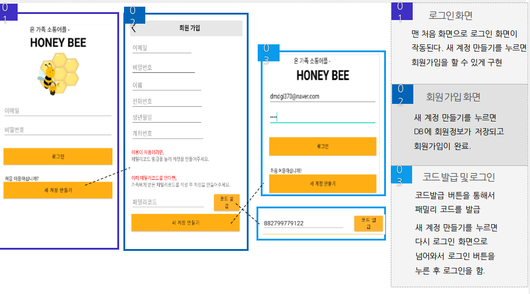
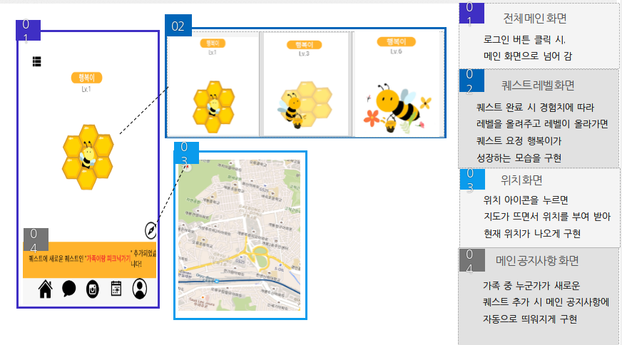
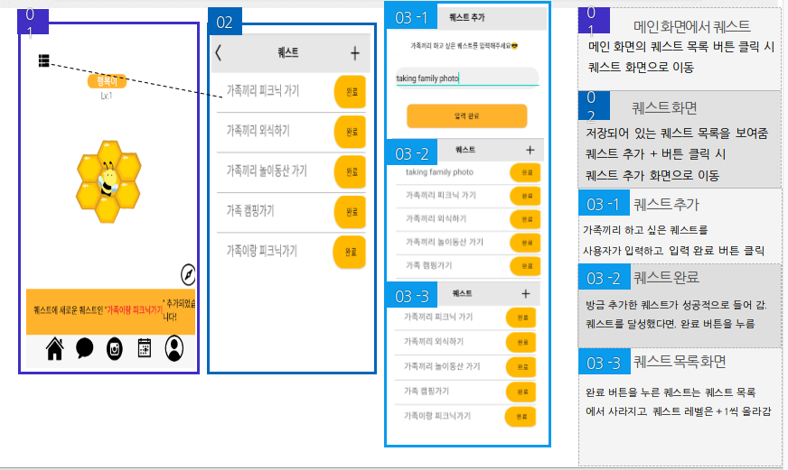
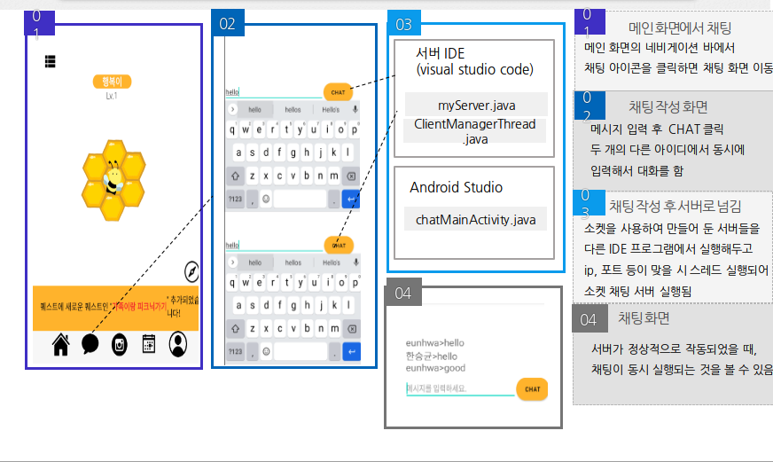
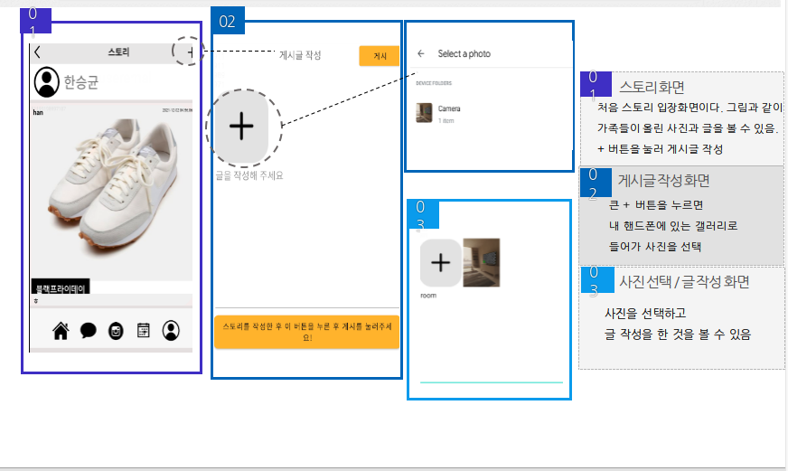
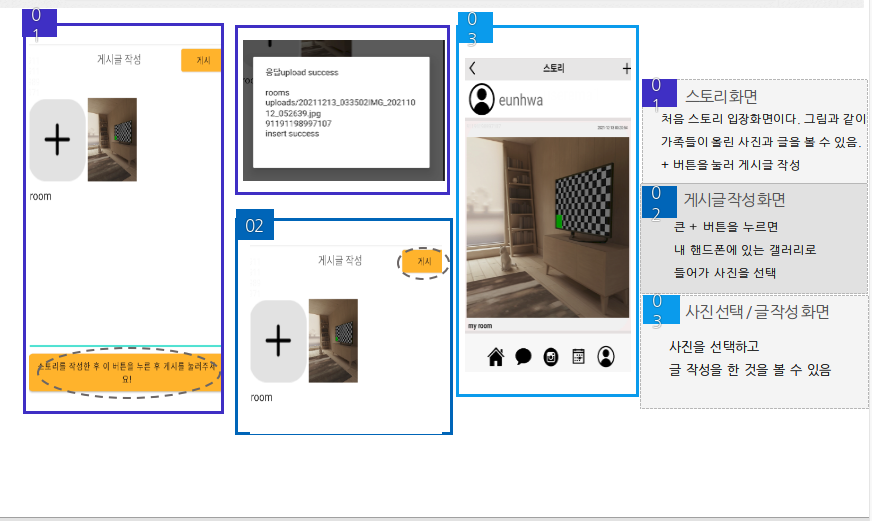
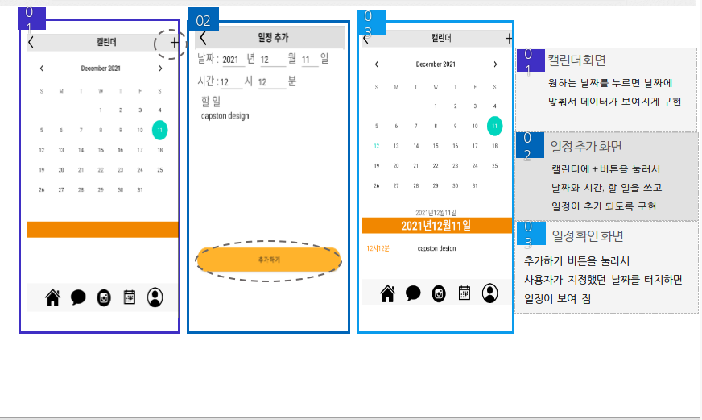
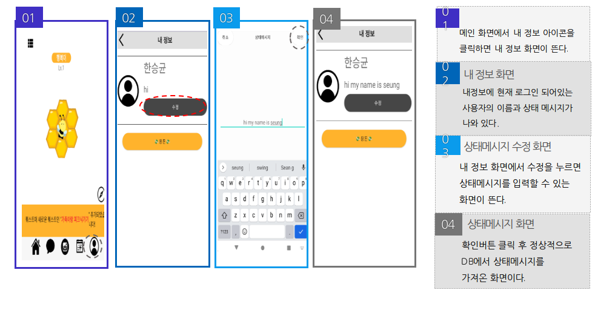